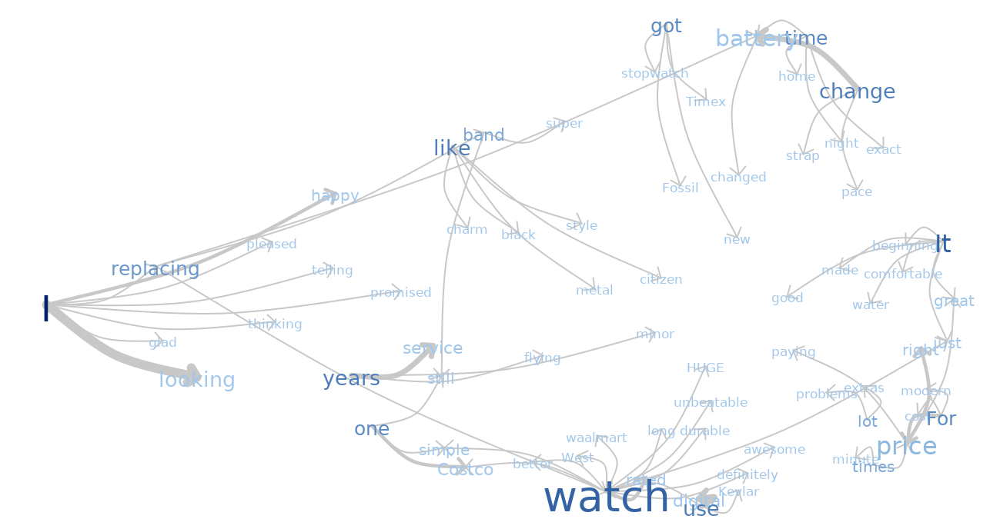
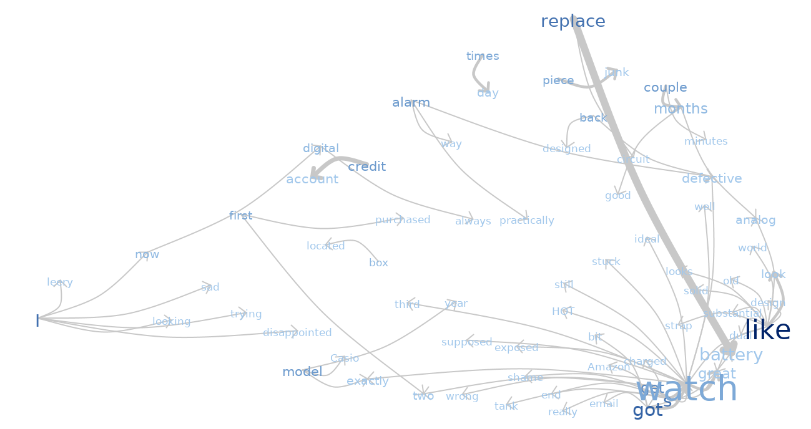
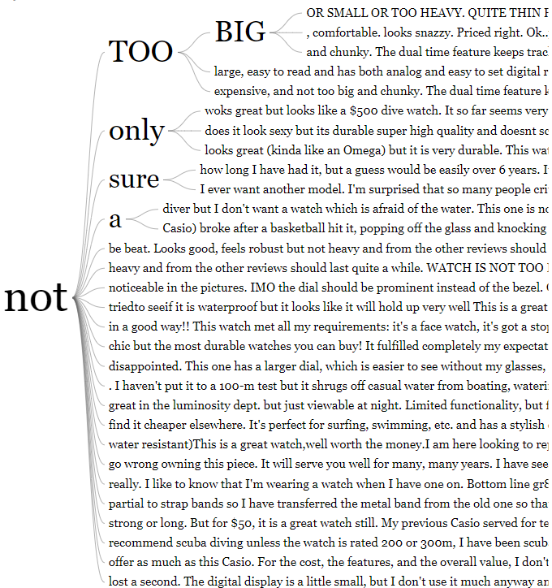
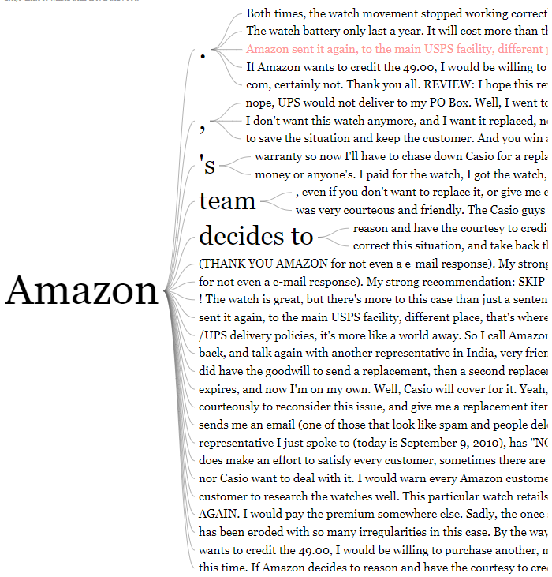

##Assignment 1

```{r,message=FALSE}
library(tm)
library(wordcloud)
library(RColorBrewer)
library(viridisLite)
library(plotrix)
library(tidyverse)
```

###Word Cloud Plot for five 

```{r}
five<-read.table("Five.txt",header=F, sep='\n')#Read file
five$doc_id=1:nrow(five)
colnames(five)[1]<-"text"
mycorpus <- Corpus(DataframeSource(five)) #Creating corpus (collection of text data)

clean_corpus <- function(corpus){
  corpus <- tm_map(corpus, removePunctuation)
  corpus <- tm_map(corpus, content_transformer(tolower))
  corpus <- tm_map(corpus, stripWhitespace)
  corpus <- tm_map(corpus,function(x) removeWords(x,stopwords("english")))
   return(corpus)
}


mycorpus <- clean_corpus(mycorpus)
tdm <- TermDocumentMatrix(mycorpus) #Creating term-document matrix
m <- as.matrix(tdm)

#here we merge all rows
v <- sort(rowSums(m),decreasing=TRUE) #Sum up the frequencies of each word
d <- data.frame(word = names(v),freq=v) #Create one column=names, second=frequences

pal<-brewer.pal(6,"PRGn") #Create palette of colors
#color_pal <- cividis(n = 8)


#wordcloud(d$word,d$freq, scale=c(8,.3),min.freq=2,max.words=100, random.order=F, rot.per=.15, colors=col_pal, vfont=c("sans #serif","plain"))

wordcloud(d$word,d$freq, scale=c(8,.3),min.freq=2,max.words=100, 
          random.order=F, rot.per=.15, colors=pal, vfont=c("sans serif","plain"))

```

###Word Cloud Plot for One Two

```{r}
oneTwo<-read.table("oneTwo.txt",header=F,sep="\n")
oneTwo$doc_id=1:nrow(oneTwo)
colnames(oneTwo)[1]<-"text"

mycor <- Corpus(DataframeSource(oneTwo))

mycor <- clean_corpus(mycor)
tdm1<- TermDocumentMatrix(mycor) #Creating term-document matrix
m1 <- as.matrix(tdm1)

#here we merge all rows
v1 <- sort(rowSums(m1),decreasing=TRUE) #Sum up the frequencies of each word
d1<- data.frame(word = names(v1),freq=v1)
pal<-brewer.pal(8,"Dark2")

wordcloud(d1$word,d1$freq, scale=c(8,.3),min.freq=2,max.words=100, random.order=F, rot.per=.15, colors=pal, vfont=c("sans serif","plain"))
```


###Pyramid Plot

```{r,message=FALSE}
j<-left_join(d,d1,by="word")

pyramid.plot(
  j$freq.x[1:10],j$freq.y[1:10],
  # Words
  labels = j$word[1:10], 
  top.labels = c("Words in File", "Common Words", "Words in oneTwo"), 
  main = "Pyramid Plot",gap=17,unit="counts")

```

The word cloud for five.txt which is the good feedback has more frequent words like watch,great,one,price,casio,years,battery etc.This makes sense as words watch and casio will be often coming in the words as this is the product.As it is a positive feedback,people are happy with the price.Great is a posisive word and may be telling it last for long with word years.

THe oneTwo.txt is the negative feedback and the frequesnt words are amazon,one,back,watch,casio,battery etc.casio and watch comes frequent like before as this is the product.Amazon ,may be because they are not happy with the amazon more than product(may be the deal,return policy,shipping etc).They would like to return back the product and hence **back** has come multiple times.

###Phrasenets

Phrase nets of five.text


{width=500 height=200} 

phrase nets of negative words 

{width=500 height=200} 

word trees

word tree of not with the positive feedback

{width=500 height=200}

word tree with the word amazon in negative feedback

{width=500 height=200}

##Assignment 2
```{r,message=FALSE}
library(tidyverse)
library(plotly)
library(plyr)
library(crosstalk)
library(GGally)

olive<-read.csv("olive.csv")
olive$Region<-as.factor(olive$Region)
levels(olive$Region)<-c("North","South","Sardinia island")
o<-SharedData$new(olive)
oo<-SharedData$new(olive,~Region,group = "Choose region")
```


###1.Scatter Plot eicoseinoic vs linoleic

```{r,set-options}

scatterolive <- plot_ly(oo, y = ~eicosenoic, x = ~ linoleic)%>%group_by(Region)%>%
  add_markers(color = I("orange"),name="hollow")%>%highlight(on="plotly_hover",persistent = F,selectize = T)

scatterolive
```


The value of eicosenoic is between one and three.
###2.Linked Scatterplot and Bar chart 

```{r,message=FALSE}
scatterolive2 <- plot_ly(o, y = ~eicosenoic, x = ~ linoleic) %>%
  add_markers(color = I("lightblue"))
barolive <-plot_ly(o, x=~Region,group="Select your region")%>%add_histogram()%>%layout(barmode="overlay")
bscols(widths=c(2, NA),filter_slider("Slider", "Stearic", o, ~stearic)
       ,subplot(scatterolive2,barolive)%>%
         highlight(on="plotly_select", dynamic=T, persistent = T, opacityDim = I(1))%>%hide_legend())
```


The brush colour and the slider,filter were the interaction operators used in this step.

Using brushing when we take out the lower values of eicosenoic(between 1 and 3),we can see they correspond to region south and sardinia Island.Now when we use slider to find the higher values of stearic we can see that they correspond to the region of north and Sardinia Island

###3.Linked Scatter Plots
```{r,message=FALSE}

scatter1 <- plot_ly(o, x = ~eicosenoic, y = ~linolenic) %>%
  add_markers(color = I("black"))
scatter2 <- plot_ly(o, x = ~arachidic, y = ~linolenic) %>%
  add_markers(color = I("black"))


subplot(scatter1,scatter2)%>%
  highlight(on="plotly_select", dynamic=T, persistent=T, opacityDim = I(1))%>%hide_legend()

```


The values of arachidic below 40 are outliers in the plot2 are also oultiers in plot 1.IN plot one their eicosenoic values are  between 1 and 3.


###4.Parallel Coordinate Plot linked Barplot and Scatterplot

```{r,message=FALSE,fig.width=20, fig.height=18}
p<-ggparcoord(olive,columns = c(4:11))

d<-plotly_data(ggplotly(p))%>%group_by(.ID)
d1<-SharedData$new(d, ~.ID, group="olive")
p1<-plot_ly(d1, x=~variable, y=~value)%>%
  add_lines(line=list(width=0.3))%>%
  add_markers(marker=list(size=0.3),
              text=~.ID, hoverinfo="text")

ButtonsX=list()
for (i in 4:11){
  ButtonsX[[i-3]]= list(method = "restyle",
                        args = list( "x", list(olive[[i]])),
                        label = colnames(olive)[i])
}

ButtonsY=list()
for (i in 4:11){
  ButtonsY[[i-3]]= list(method = "restyle",
                        args = list( "y", list(olive[[i]])),
                        label = colnames(olive)[i])
}

ButtonsZ=list()
for (i in 4:11){
  ButtonsZ[[i-3]]= list(method = "restyle",
                        args = list( "z", list(olive[[i]])),
                        label = colnames(olive)[i])
}

p3<-plot_ly(o,x=~palmitic,y=~stearic,z=~oleic)%>%add_markers() %>%
  layout(xaxis=list(title=""), yaxis=list(title=""),
         title = "Select variable:",
         updatemenus = list(
           list(y=0.9, buttons = ButtonsX),
           list(y=0.7, buttons = ButtonsY),
           list(y=0.5, buttons = ButtonsZ)
         )  )


bscols(p1%>%highlight(on="plotly_select", dynamic=T, persistent = T, opacityDim = I(1))%>%
         hide_legend(),barolive,
       p3%>%highlight(on="plotly_click", dynamic=T, persistent = T)%>%hide_legend(),
       widths = c(7,5,9))


```
The parallel coordinate plot demonstrate clusters among observations that belong to the same region.
i think oleic,lieoneic,Eicosenoic are three influential variables.while using this three variable we  think we can differentiate regions.

##Appendix

```{r,eval=FALSE}

library(tm)
library(wordcloud)
library(RColorBrewer)
library(viridisLite)
library(plotrix)
library(tidyverse)
five<-read.table("Five.txt",header=F, sep='\n')#Read file
five$doc_id=1:nrow(five)
colnames(five)[1]<-"text"
mycorpus <- Corpus(DataframeSource(five)) #Creating corpus (collection of text data)

clean_corpus <- function(corpus){
  corpus <- tm_map(corpus, removePunctuation)
  corpus <- tm_map(corpus, content_transformer(tolower))
  corpus <- tm_map(corpus, stripWhitespace)
  corpus <- tm_map(corpus,function(x) removeWords(x,stopwords("english")))
  return(corpus)
}


mycorpus <- clean_corpus(mycorpus)
tdm <- TermDocumentMatrix(mycorpus) #Creating term-document matrix
m <- as.matrix(tdm)

#here we merge all rows
v <- sort(rowSums(m),decreasing=TRUE) #Sum up the frequencies of each word
d <- data.frame(word = names(v),freq=v) #Create one column=names, second=frequences

pal<-brewer.pal(6,"PRGn") #Create palette of colors
#color_pal <- cividis(n = 8)


#wordcloud(d$word,d$freq, scale=c(8,.3),min.freq=2,max.words=100, random.order=F, rot.per=.15, colors=col_pal, vfont=c("sans #serif","plain"))

wordcloud(d$word,d$freq, scale=c(8,.3),min.freq=2,max.words=100, random.order=F, rot.per=.15, colors=pal, vfont=c("sans serif","plain"))

oneTwo<-read.table("oneTwo.txt",header=F,sep="\n")
oneTwo$doc_id=1:nrow(oneTwo)
colnames(oneTwo)[1]<-"text"

mycor <- Corpus(DataframeSource(oneTwo))

mycor <- clean_corpus(mycor)
tdm1<- TermDocumentMatrix(mycor) #Creating term-document matrix
m1 <- as.matrix(tdm1)

#here we merge all rows
v1 <- sort(rowSums(m1),decreasing=TRUE) #Sum up the frequencies of each word
d1<- data.frame(word = names(v1),freq=v1)
pal<-brewer.pal(8,"Dark2")

wordcloud(d1$word,d1$freq, scale=c(8,.3),min.freq=2,max.words=100, random.order=F, rot.per=.15, colors=pal, vfont=c("sans serif","plain"))

j<-left_join(d,d1,by="word")

pyramid.plot(
  j$freq.x[1:10],j$freq.y[1:10],
  # Words
  labels = j$word[1:10], 
  top.labels = c("Words in File", "Common Words", "Words in oneTwo"), 
  main = "Pyramid Plot",gap=17,unit="counts")


library(tidyverse)
library(plotly)
library(plyr)
library(crosstalk)
library(GGally)

olive<-read.csv("olive.csv")
olive$Region<-as.factor(olive$Region)
levels(olive$Region)<-c("North","South","Sardinia island")
o<-SharedData$new(olive)
oo<-SharedData$new(olive,~Region,group = "Choose region")

scatterolive <- plot_ly(oo, y = ~eicosenoic, x = ~ linoleic)%>%group_by(Region)%>%
  add_markers(color = I("orange"),name="hollow")%>%highlight(on="plotly_hover",persistent = F,selectize = T)

scatterolive

scatterolive2 <- plot_ly(o, y = ~eicosenoic, x = ~ linoleic) %>%
  add_markers(color = I("lightblue"))
barolive <-plot_ly(o, x=~Region,group="Select your region")%>%add_histogram()%>%layout(barmode="overlay")
bscols(widths=c(2, NA),filter_slider("Slider", "Stearic", o, ~stearic)
       ,subplot(scatterolive2,barolive)%>%
         highlight(on="plotly_select", dynamic=T, persistent = T, opacityDim = I(1))%>%hide_legend())


scatter1 <- plot_ly(o, y = ~eicosenoic, x = ~linolenic) %>%
  add_markers(color = I("black"))
scatter2 <- plot_ly(o, y = ~arachidic, x = ~linolenic) %>%
  add_markers(color = I("black"))


subplot(scatter1,scatter2)%>%
  highlight(on="plotly_select", dynamic=T, persistent=T, opacityDim = I(1))%>%hide_legend()

p<-ggparcoord(olive,columns = c(4:11))

d<-plotly_data(ggplotly(p))%>%group_by(.ID)
d1<-SharedData$new(d, ~.ID, group="olive")
p1<-plot_ly(d1, x=~variable, y=~value)%>%
  add_lines(line=list(width=0.3))%>%
  add_markers(marker=list(size=0.3),
              text=~.ID, hoverinfo="text")

ButtonsX=list()
for (i in 4:11){
  ButtonsX[[i-3]]= list(method = "restyle",
                        args = list( "x", list(olive[[i]])),
                        label = colnames(olive)[i])
}

ButtonsY=list()
for (i in 4:11){
  ButtonsY[[i-3]]= list(method = "restyle",
                        args = list( "y", list(olive[[i]])),
                        label = colnames(olive)[i])
}

```


